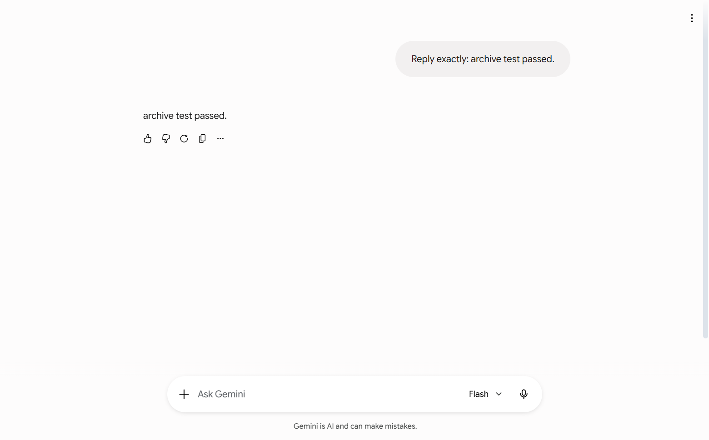
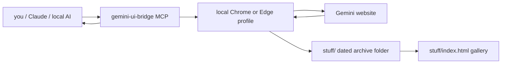
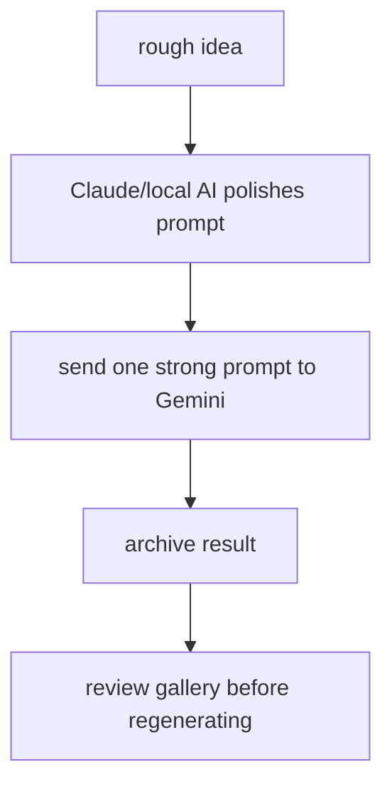

# Gemini UI Bridge

> use your Gemini web plan from other local AI apps, without paying for the Gemini API.

I made this because API pricing is annoying and sometimes you already have Gemini open in the browser. This bridge lets an MCP client, like Claude Desktop, drive the Gemini website through your own signed-in Chrome/Edge profile.

It is local, browser-based, and honest about its limits. No Gemini API key. No paid API calls. No secret cookie export.



<p>
  <b>Status:</b> personal tool, not production infra<br>
  <b>Works through:</b> Chrome/Edge + Playwright + MCP<br>
  <b>Best for:</b> personal assistant workflows, prompt testing, images/videos/music through Gemini UI
</p>

## quick map

- [what this does](#what-this-does)
- [how it works](#how-it-works)
- [interactive website](#interactive-website)
- [screenshots](#screenshots)
- [install](#install)
- [claude desktop setup](#claude-desktop-setup)
- [daily use](#daily-use)
- [saved outputs](#saved-outputs)
- [security rules](#security-rules)
- [zero-cost quality upgrades](#zero-cost-quality-upgrades)

## what this does

| thing | supported |
| --- | --- |
| normal Gemini chat | yes |
| Create image | yes |
| Create video | yes |
| Create music | yes |
| Canvas | yes |
| Guided Learning | yes |
| upload local files | yes |
| archive prompts/responses/screenshots | yes |
| hide the browser offscreen | yes |
| official Gemini API replacement | no |

This is useful if you want Claude or another local AI to say: "ask Gemini this", "make an image prompt", "open Gemini image mode", "save the output", etc.

It is not useful if you need 24/7 production reliability. Gemini can change its UI and break browser automation. That is the trade.

## how it works



<details open>
<summary><b>the short version</b></summary>

1. You sign in to Gemini yourself in a separate local browser profile.
2. Claude calls an MCP tool like `gemini_prompt` or `gemini_create_image`.
3. The bridge pastes the prompt into Gemini.
4. It waits for the visible response.
5. It saves the run into `stuff/YYYY-MM-DD_HH-mm-ss-SSS_tool-name/`.
6. It returns the response and archive folder back to Claude.

</details>

<details>
<summary><b>why this exists</b></summary>

Because sometimes you do not want another paid API bill. If you already have access to Gemini web features, this gives your local AI apps a way to use that browser session.

But it still behaves like browser automation, not a clean API. So it should be used slowly and respectfully, like a human using the website.

</details>

## screenshots

These are sanitized previews. Real account names, chat sidebars, browser cookies, generated files, and private prompts are not committed.

### Gemini UI run


### Saved-output gallery


### Terminal / safety check


### Claude sees MCP tools


## interactive website

There is also a more visual 3D explainer site in `docs/`.

Run it locally:

```powershell
npm run site
```

Then open:

```text
http://127.0.0.1:4173
```

It explains the whole flow with a 3D bridge map, clickable steps, tool cards, screenshots, and the security checklist.

## install

<details open>
<summary><b>1. clone and install</b></summary>

```powershell
git clone https://github.com/amandeepintl/gemini-ui-bridge.git
cd gemini-ui-bridge
npm install
Copy-Item .env.example .env
```

</details>

<details open>
<summary><b>2. login to Gemini</b></summary>

```powershell
npm run launch-browser
```

Or double-click:

```text
OPEN_GEMINI_LOGIN.bat
```

Sign in manually. The login stays inside `profiles/real-browser`, which is ignored by git.

</details>

<details>
<summary><b>3. run the bridge</b></summary>

```powershell
npm start
```

Or use one of the BAT files:

```text
START_BRIDGE.bat
START_BRIDGE_HIDDEN.bat
START_BRIDGE_ULTRA_LOW.bat
```

</details>

## claude desktop setup

Add this MCP server to Claude Desktop. Change the path to wherever you cloned the repo:

```json
{
  "mcpServers": {
    "gemini-ui-bridge": {
      "command": "node",
      "args": [
        "--max-old-space-size=128",
        "C:\\path\\to\\gemini-ui-bridge\\src\\mcp-server.js"
      ],
      "env": {
        "REAL_BROWSER_DEBUG_PORT": "9222",
        "CHROME_CDP_URL": "http://127.0.0.1:9222",
        "LOW_RESOURCE_MODE": "true",
        "GEMINI_BROWSER_VISIBILITY": "offscreen",
        "GEMINI_BRING_TO_FRONT": "false",
        "GEMINI_CAPTURE_MEDIA_REFS_FOR_TEXT": "false",
        "GEMINI_RETURN_PROMPT_IN_RESPONSE": "true",
        "HEADLESS": "false"
      }
    }
  }
}
```

Then restart Claude and ask:

```text
Call gemini_read_guide, then gemini_status.
```

<details>
<summary><b>available MCP tools</b></summary>

```text
gemini_read_guide
gemini_status
gemini_open
gemini_browser_visibility
gemini_prompt
gemini_create_image
gemini_create_video
gemini_create_music
gemini_canvas
gemini_guided_learning
gemini_upload_file
gemini_open_tool
gemini_cleanup_chat
gemini_list_archives
gemini_latest_archive
gemini_open_stuff
gemini_cleanup_archives
gemini_close
```

</details>

<details>
<summary><b>supported Gemini UI modes</b></summary>

```text
chat
upload_files
add_from_drive
photos
avatar
import_code
notebooks
create_image
create_video
canvas
create_music
guided_learning
```

</details>

## daily use

### ask Gemini normally

```powershell
curl -X POST http://127.0.0.1:8787/v1/prompt `
  -H "Content-Type: application/json" `
  -d "{\"prompt\":\"Reply exactly: bridge is working\"}"
```

### use a Gemini mode

```powershell
curl -X POST http://127.0.0.1:8787/v1/prompt `
  -H "Content-Type: application/json" `
  -d "{\"tool\":\"create_image\",\"prompt\":\"Create a clean app icon for a study app.\"}"
```

### hide or show the browser

```text
HIDE_GEMINI_BROWSER.bat
SHOW_GEMINI_BROWSER.bat
```

The hidden mode moves the browser offscreen and stops it from jumping over your work. It is convenience, not security magic.

## saved outputs

Every successful run gets a folder like:

```text
stuff/YYYY-MM-DD_HH-mm-ss-SSS_tool-name/
```

Inside:

```text
prompt.txt
response.md
result.json
media-refs.json
media-downloads.json
page.png
media/
```

Failed runs are saved too:

```text
stuff/YYYY-MM-DD_HH-mm-ss-SSS_error_tool-name/
```

Open the gallery:

```powershell
npm run open-stuff
```

Or double-click:

```text
OPEN_STUFF_GALLERY.bat
```

## security rules

This repo is designed to avoid uploading private local stuff.

Never commit:

- `.env`
- `profiles/`
- `stuff/`
- screenshots with your account/sidebar visible
- generated files that contain private prompts
- exported Claude config files with personal paths
- tokens, passwords, cookies, API keys

Before pushing:

```powershell
npm run security-check
git status --ignored
```

The security check blocks obvious mistakes, but still look at `git status`. Your browser profile is basically a logged-in browser, so treat it like one.

## zero-cost quality upgrades

The way to make this better for free is not "spam Gemini harder". It is fewer wasted calls.

Good flow:



Use this pattern:

- ask Claude to improve/check the prompt first
- send Gemini one strong final prompt
- use `retries: 1` only for UI failures/timeouts
- for media, include aspect ratio, duration, style, camera, mood, and negative constraints
- do not ask Gemini for shorter output unless you actually want shorter output

Same limits, better hit rate.

## honest rating

| use case | rating |
| --- | --- |
| personal assistant bridge | 7.5/10 |
| cheap creative workflow | 8/10 |
| production integration | 2/10 |
| official API replacement | 3/10 |

That is the truth. It is useful, but it is still a browser bridge.

## license

MIT
