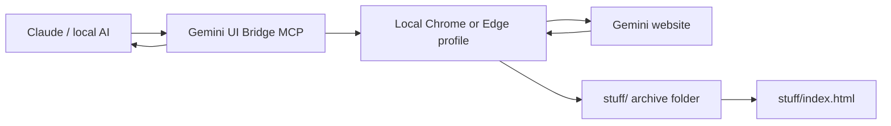
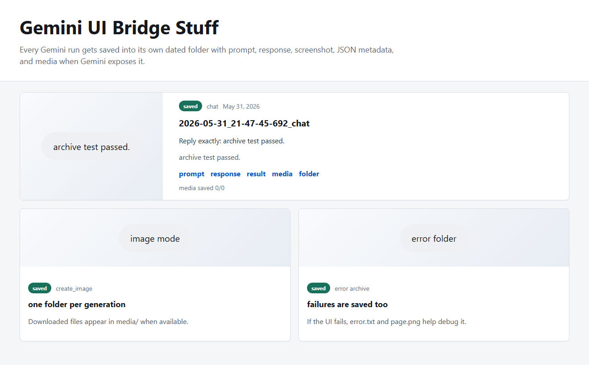
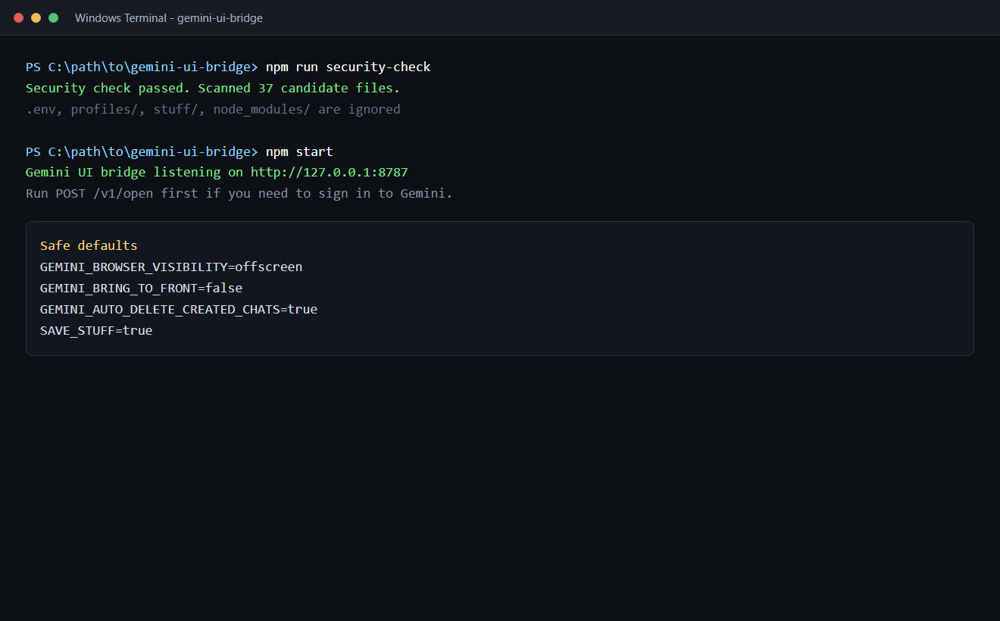
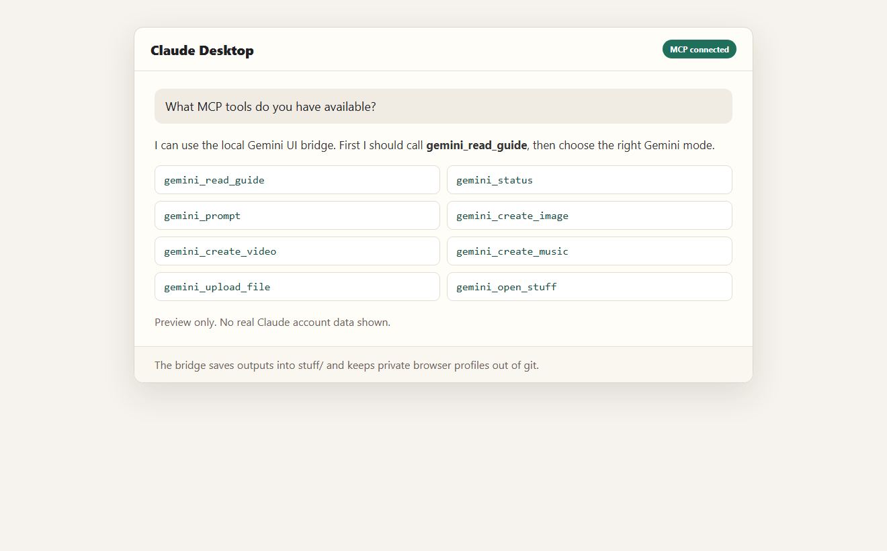

# Gemini UI Bridge

Gemini UI Bridge is a local MCP and REST bridge for people who already use Gemini in the browser and want another AI app, like Claude Desktop, to send prompts to it.

It does not use the paid Gemini API. It uses your signed-in Gemini web session in a separate local browser profile, sends the prompt, waits for the visible response, and saves the run in `stuff/`.

This is useful when you want to connect your Gemini subscription to a local assistant workflow without paying for another API bill.


## What It Can Do

| Feature | Status |
| --- | --- |
| Normal Gemini chat | Supported |
| Gemini Create image | Supported |
| Gemini Create video | Supported |
| Gemini Create music | Supported |
| Gemini Canvas | Supported |
| Guided Learning | Supported |
| Local file upload | Supported |
| Saved output folders | Supported |
| Hidden/offscreen browser mode | Supported |
| Official Gemini API replacement | Not supported |

## What This Project Is

This project is browser automation. It controls Gemini through the same website you normally use.

That makes it good for personal use, testing prompts, creative runs, file uploads, and connecting Claude Desktop to Gemini web features.

## What This Project Is Not

This is not an official Google API, and it is not meant to bypass Google limits, login checks, account protections, or plan rules.

Because it uses the website, it has normal browser-automation limits:

- Gemini UI changes can break selectors.
- Login, captcha, or account checks may still need you.
- Some image, video, or music results may need manual download.
- It is slower and less reliable than a real API.
- It is not a good choice for a production backend.

For a personal assistant setup, it is useful. For a real production app, use an official API.

## How It Works



1. You sign in to Gemini in a separate local browser profile.
2. Claude or another MCP client calls one of the bridge tools.
3. The bridge opens the right Gemini mode.
4. It sends your prompt through the Gemini website.
5. It waits for the response.
6. It saves the prompt, response, screenshot, and metadata under `stuff/`.
7. It returns the useful result and archive path to the AI client.

## Interactive Project Site

The repo includes an interactive explainer site in `docs/`.

Run it locally:

```powershell
npm run site
```

Then open:

```text
http://127.0.0.1:4173
```

The site shows the full flow with a 3D diagram, a simulated run, tool cards, screenshots, and a security checklist.

## Screenshots

### Gemini Response


### Saved Output Gallery



### Terminal Check



### Claude MCP Tools



## Install

```powershell
git clone https://github.com/amandeepintl/gemini-ui-bridge.git
cd gemini-ui-bridge
npm install
Copy-Item .env.example .env
```

## First Login

Run:

```powershell
npm run launch-browser
```

Or double-click:

```text
OPEN_GEMINI_LOGIN.bat
```

Sign in to Gemini in the opened browser window. The login is stored in `profiles/real-browser`, which is ignored by git.

## Start The Bridge

Normal mode:

```powershell
npm start
```

Hidden/offscreen mode:

```text
START_BRIDGE_HIDDEN.bat
```

Low-resource mode:

```text
START_BRIDGE_ULTRA_LOW.bat
```

## Claude Desktop Setup

Add this MCP server to Claude Desktop. Change the path to wherever you cloned the repo:

```json
{
  "mcpServers": {
    "gemini-ui-bridge": {
      "command": "node",
      "args": [
        "--max-old-space-size=128",
        "C:\\path\\to\\gemini-ui-bridge\\src\\mcp-server.js"
      ],
      "env": {
        "REAL_BROWSER_DEBUG_PORT": "9222",
        "CHROME_CDP_URL": "http://127.0.0.1:9222",
        "LOW_RESOURCE_MODE": "true",
        "GEMINI_BROWSER_VISIBILITY": "offscreen",
        "GEMINI_BRING_TO_FRONT": "false",
        "GEMINI_CAPTURE_MEDIA_REFS_FOR_TEXT": "false",
        "GEMINI_RETURN_PROMPT_IN_RESPONSE": "true",
        "HEADLESS": "false"
      }
    }
  }
}
```

Restart Claude Desktop, then ask:

```text
Call gemini_read_guide, then gemini_status.
```

## MCP Tools

```text
gemini_read_guide
gemini_status
gemini_open
gemini_browser_visibility
gemini_prompt
gemini_create_image
gemini_create_video
gemini_create_music
gemini_canvas
gemini_guided_learning
gemini_upload_file
gemini_open_tool
gemini_cleanup_chat
gemini_list_archives
gemini_latest_archive
gemini_open_stuff
gemini_cleanup_archives
gemini_close
```

## Supported Gemini Modes

```text
chat
upload_files
add_from_drive
photos
avatar
import_code
notebooks
create_image
create_video
canvas
create_music
guided_learning
```

## REST Examples

Send a normal prompt:

```powershell
curl -X POST http://127.0.0.1:8787/v1/prompt `
  -H "Content-Type: application/json" `
  -d "{\"prompt\":\"Reply exactly: bridge is working\"}"
```

Use a Gemini mode:

```powershell
curl -X POST http://127.0.0.1:8787/v1/prompt `
  -H "Content-Type: application/json" `
  -d "{\"tool\":\"create_image\",\"prompt\":\"Create a clean app icon for a study app.\"}"
```

## Saved Outputs

Every successful run gets a dated folder:

```text
stuff/YYYY-MM-DD_HH-mm-ss-SSS_tool-name/
```

Typical files:

```text
prompt.txt
response.md
result.json
media-refs.json
media-downloads.json
page.png
media/
```

Failed runs are saved too:

```text
stuff/YYYY-MM-DD_HH-mm-ss-SSS_error_tool-name/
```

Open the gallery:

```powershell
npm run open-stuff
```

Or double-click:

```text
OPEN_STUFF_GALLERY.bat
```

## Security Checklist

This project controls a real browser profile, so treat the profile like a logged-in browser.

Do not commit:

- `.env`
- `profiles/`
- `stuff/`
- screenshots with private account details
- generated files that contain private prompts
- exported Claude config files with personal paths
- tokens, passwords, cookies, or API keys

Before pushing:

```powershell
npm run security-check
git status --ignored
```

The security check catches common mistakes, but still review `git status` yourself before pushing.

## Getting Better Results Without Spending Money

The best way to improve quality is to waste fewer Gemini runs.

Recommended workflow:

1. Let Claude or another local AI clean up the prompt first.
2. Send one strong final prompt to Gemini.
3. Retry only when the browser automation fails or Gemini times out.
4. Check the `stuff/` gallery before regenerating the same idea.
5. Keep Gemini output quality high. Do not ask for short answers unless you actually want short answers.

This keeps the same Gemini limits, but gives you a better chance of getting the result you wanted.

## Honest Rating

| Use case | Rating |
| --- | --- |
| Personal assistant bridge | 7.5/10 |
| Cheap creative workflow | 8/10 |
| Production integration | 2/10 |
| Official API replacement | 3/10 |

## License

MIT
